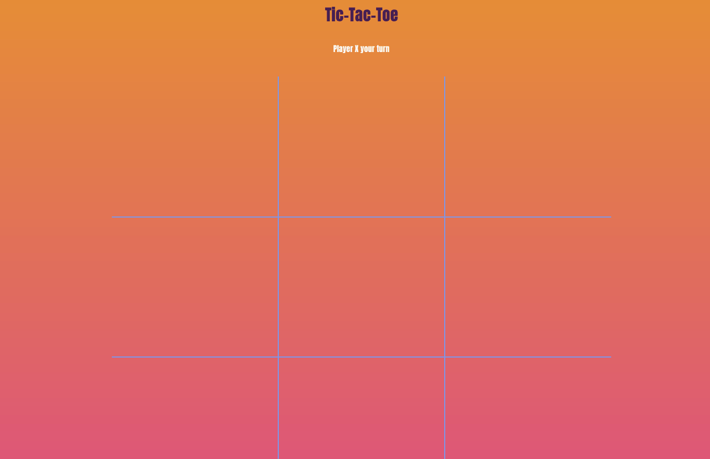

# TicTacToe

## Taking you back to childhood. This 3 x 3 grid game allows players to win by matching 3 x's or o's in a row. 

# DEMO

# CODE SNIPPETS

`js

      if (
        tiles[0].innerHTML == tiles[1].innerHTML &&
        tiles[1].innerHTML == tiles[2].innerHTML &&
        tiles[0].innerHTML.trim() != ""
      ) {
        displayWinner(0, 1, 2);
      } else if (
        tiles[3].innerHTML == tiles[4].innerHTML &&
        tiles[4].innerHTML == tiles[5].innerHTML &&
        tiles[3].innerHTML.trim() != ""
      ) {
        displayWinner(3, 4, 5);
      } else if (
        tiles[6].innerHTML == tiles[7].innerHTML &&
        tiles[7].innerHTML == tiles[8].innerHTML &&
        tiles[6].innerHTML.trim() != ""
      ) {
        displayWinner(6, 7, 8);
      } else if (
        tiles[0].innerHTML == tiles[3].innerHTML &&
        tiles[3].innerHTML == tiles[6].innerHTML &&
        tiles[0].innerHTML.trim() != ""
      ) {
        displayWinner(0, 3, 6);
      } else if (
        tiles[1].innerHTML == tiles[4].innerHTML &&
        tiles[4].innerHTML == tiles[7].innerHTML &&
        tiles[1].innerHTML.trim() != ""
      ) {
        displayWinner(1, 4, 7);
      } else if (
        tiles[2].innerHTML == tiles[5].innerHTML &&
        tiles[5].innerHTML == tiles[8].innerHTML &&
        tiles[2].innerHTML.trim() != ""
      ) {
        displayWinner(2, 5, 8);
      } else if (
        tiles[0].innerHTML == tiles[4].innerHTML &&
        tiles[4].innerHTML == tiles[8].innerHTML &&
        tiles[0].innerHTML.trim() != ""
      ) {
        displayWinner(0, 4, 8);
      } else if (
        tiles[2].innerHTML == tiles[4].innerHTML &&
        tiles[4].innerHTML == tiles[6].innerHTML &&
        tiles[2].innerHTML.trim() != ""
      ) {
        displayWinner(2, 4, 6);

      } else if (
        tiles[0].innerHTML != tiles[1].innerHTML &&
        tiles[2].innerHTML != tiles[3].innerHTML &&
        tiles[4].innerHTML != tiles[5].innerHTML &&
        tiles[6].innerHTML != tiles[7].innerHTML && tiles[8].innerHTML

      ) {

        noWinner();

      }

    }

  });
  `

